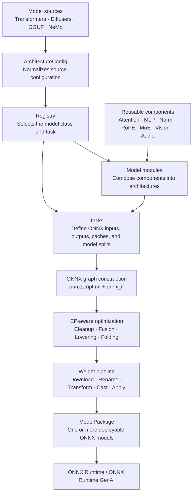
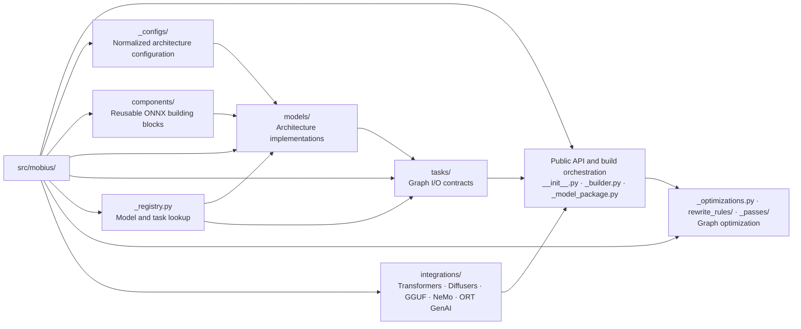

# mobius

[](https://pypi.org/project/mobius-onnx/)
[](https://github.com/onnxruntime/mobius/actions/workflows/main.yml)
[](https://github.com/onnxruntime/mobius/actions/workflows/gpu_l4_golden_parity.yml)
[](https://github.com/onnxruntime/mobius/actions/workflows/gpu_l5_generation_e2e.yml)
[](https://github.com/onnxruntime/mobius/actions/workflows/nightly_l2.yml)
[](https://github.com/astral-sh/ruff)

ONNX model definitions for GenAI using the `onnxscript.nn` API.

## Overview

This package provides model definitions for generative AI architectures — LLMs,
MoE, multimodal, encoder-only, encoder-decoder, vision, audio, and diffusion
models — built directly as ONNX graphs using `onnxscript.nn.Module`. Rather than
tracing or exporting PyTorch models, it **constructs** the ONNX graph
declaratively, then applies pretrained HuggingFace weights.

Supports building ONNX models from HuggingFace model IDs with automatic weight
downloading, dtype casting (including bfloat16 via `ir.LazyTensor`), and
multi-component export for pipelines.

📖 **[Documentation](https://onnxruntime.github.io/mobius/)** · 📦 **[Supported Models](https://onnxruntime.github.io/mobius/models/index.html)**

## Highlighted Models

| Category | Examples |
|---|---|
| **Text Generation** | Llama 2/3/4, Mistral, Qwen 2/2.5/3/3.5/3.6, Phi-3/3.5, Gemma 1/2/3/4, Granite, GPT-2, OPT, OLMo, SmolLM3, and many more |
| **Mixture of Experts** | PhiMoE, GPTOSS, Mixtral, OLMoE, DeepSeek-V2/V3, Qwen2-MoE, Qwen3-MoE, Qwen3-Next, GLM-4-MoE, Arctic, DBRX, Jamba |
| **Multimodal** | Gemma 3/4, Phi-4MM (vision + audio + LoRA), Nemotron Parse, LLaVA, InternVL2, Mage-VL (image + streaming video), MiniCPM-V 4.6, Qwen2.5-VL, Qwen3-VL, Qwen3.5/3.6-VL, Pixtral |
| **Encoder-only** | BERT, RoBERTa, ALBERT, DeBERTa, DistilBERT, ELECTRA, XLNet |
| **Encoder-Decoder** | BART, T5/mT5, Marian, M2M-100, Pegasus, BigBird-Pegasus |
| **Speech-to-Text** | Whisper, Moonshine, FastConformer-RNNT, FunASR, GLM-ASR, Qwen3-ASR, SenseVoice |
| **Audio** | Wav2Vec2, HuBERT, WavLM, SpeechT5 |
| **Vision** | ViT, BEiT, DeiT, DINOv2, Swin, CLIP, SigLIP |
| **Diffusion** | Stable Diffusion (UNet + VAE + ControlNet), Flux, SD3, DiT, QwenImage / Qwen-Image-Edit-2509, HunyuanDiT, CogVideoX |
| **Adapters** | T2I-Adapter, IP-Adapter |

Mage-VL supports direct three-model ONNX export. ORT GenAI export is currently
rejected because the runtime cannot supply its required `patch_positions` input
or Mage-VL's 1D decoder positions.

Supports **290+ Transformers model types** and **10 Diffusers component types**
across **40+ task types** and **100+ reusable components**.

See the [model documentation](https://onnxruntime.github.io/mobius/models/index.html) for the complete list.

## Installation

```bash
pip install -e .
```

For running tests:

```bash
pip install -e ".[testing]"
```

## Quick Start

### Python API

```python
from mobius import build

# Build a model package with weights
pkg = build("meta-llama/Llama-3.2-1B")
pkg.save("output/llama-3.2-1b/")
```

**Static cache** (opt-in) pre-allocates fixed-size KV cache buffers, which is
useful when you know the maximum sequence length up front:

```python
from mobius import build, CausalLMTask

task = CausalLMTask(static_cache=True, max_seq_len=2048)
pkg = build("meta-llama/Llama-3.2-1B", task=task)
pkg.save("output/llama-3.2-1b-static/")
```

**EP-aware optimization** generates graphs tuned for a specific runtime execution
provider. Pass `execution_provider` to target CUDA, DirectML, WebGPU, and more —
each with the right set of fused kernels and lowering passes applied automatically:

```python
from mobius import build

# CUDA: GQA fusion, SkipLayerNorm, PackQKV
pkg = build("meta-llama/Llama-3.2-1B",
            execution_provider="cuda", dtype="f16")

# WebGPU: GQA fusion, Shape ops replaced with portable alternatives
pkg = build("meta-llama/Llama-3.2-1B",
            execution_provider="webgpu", dtype="f16")
```

See the [EP quickstart](docs/ep_quickstart.md) and
[full EP reference](docs/execution_providers.md) for all supported EPs and options.

### CLI

```sh
mobius build --model Qwen/Qwen2.5-0.5B --output output_dir/

# Build for CUDA with f16
mobius build --model meta-llama/Llama-3.2-1B --output output_dir/ --ep cuda --dtype f16

# Build a diffusers pipeline (all components)
mobius build --model Qwen/Qwen-Image-2512 --output output_dir/

# Build encoder-decoder model (produces encoder/model.onnx + decoder/model.onnx)
mobius build --model openai/whisper-tiny --output output_dir/
```

Build-mode toggles use the cargo-style `--features` option. Available features
are `static-cache`, `fp8-kv-cache`, `prune-prefill-prefix`, and `text-only`. Pass them
as a comma-separated list or repeat the option:

```sh
mobius build --model meta-llama/Llama-3.2-1B --output output_dir/ \
      --features static-cache,prune-prefill-prefix --max-seq-len 2048
```

Use `--release` with either `build` or `build-gguf` to potentially reduce saved model size
by stripping build-time debug and provenance metadata. Functional metadata with keys prefixed by
`mobius.` is preserved:

```sh
mobius build --model meta-llama/Llama-3.2-1B --output output_dir/ --release
mobius build-gguf model.gguf --output output_dir/ --release
```

See the [CLI Reference](https://onnxruntime.github.io/mobius/cli_reference.html) for all subcommands and flags.

### Examples

- [`examples/build_and_save.py`](examples/build_and_save.py) — Build and save ONNX models (simplest workflow)
- [`examples/text_generation.py`](examples/text_generation.py) — Greedy text generation with a causal LM
- [`examples/static_cache_generation.py`](examples/static_cache_generation.py) — Text generation with static KV cache
- [`examples/multimodal_generation.py`](examples/multimodal_generation.py) — Image captioning with a multimodal model

## Architecture



The package is organised into four layers:

- **Components** — `onnxscript.nn.Module` building blocks (Attention, MLP,
  DecoderLayer, RoPE, VisionEncoder, MoELayer, …)
- **Models** — Full architectures composed from components
- **Tasks** — Define the ONNX graph I/O contract (inputs, outputs, KV cache)
- **Registry** — Maps HuggingFace `model_type` strings to model classes

See the [design document](https://onnxruntime.github.io/mobius/design.html) for details.

### Repository organization



Supporting directories:

- `tests/` contains graph-construction, integration, parity, generation, and runtime tests.
- `src/mobius/**/*_test.py` contains unit tests colocated with their implementation.
- `examples/` demonstrates text, multimodal, speech, and diffusion workflows.
- `docs/` contains user guides, design documentation, and API reference material.

## Development

```bash
# Unit tests (fast, no network needed)
pytest tests/build_graph_test.py -v

# Integration tests (downloads models)
pytest tests/integration_test.py -m integration -v

# All unit tests (components, configs, tasks, models)
pytest src tests -m "not integration" -v

# Linting
lintrunner f --all-files
```

### Adding a new model

To [request a new model](https://github.com/onnxruntime/mobius/issues/new?template=model-request.yml),
or ask an AI coding agent to implement a new model, use the resources below:

See the [AI-assisted model support strategy](https://onnxruntime.github.io/mobius/ai-model-support-strategy.html)
and the developer skills in `.agents/skills/`:

| Skill | Use when |
|-------|----------|
| `adding-a-new-model` | Adding any new HuggingFace model architecture |
| `reusable-components` | Creating or extending components |
| `moe-models` | Adding a Mixture-of-Experts model |
| `multimodal-models` | Adding a vision-language model |
| `writing-tests` | Writing unit or integration tests |
| `writing-rewrite-rules` | Adding ONNX graph rewrite rules |
